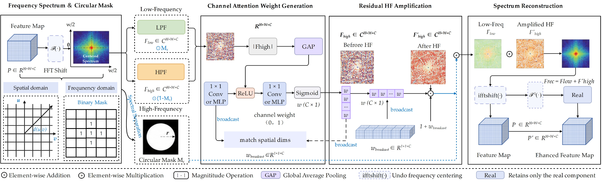

# HFA-Mamba: High-Frequency-Aware Mamba for Tiny Person Detection in Aerial Images

<p align="center">
  <a href="#"></a>
  <a href="#"></a>
  <a href="https://www.python.org/"></a>
  <a href="https://pytorch.org/"></a>
  <a href="LICENSE"></a>
</p>

Official implementation of **"High-Frequency-Aware Mamba for Tiny Person Detection in Aerial Images"**.

HFA-Mamba jointly integrates **high-resolution representation learning**, **frequency-domain feature enhancement**, and **scale-aware objective reweighting** to detect small, low-contrast persons in wide-area aerial imagery (search-and-rescue, public-safety, disaster-response).

> This repo is a fork of [Mamba-YOLO](https://github.com/HZAI-ZJNU/Mamba-YOLO) (AAAI 2025). It keeps Mamba-YOLO's layout (`ultralytics/` vendored fork, `selective_scan/` CUDA ext, `mbyolo_train.py` entry) and adds two novel pieces -- the **High-Frequency Refocus Module (HFRM)** and the **Scale-Balanced Loss (SBL)**. Both are injected **at runtime**, so **no upstream file is modified**. One command (`build_with_mambayolo.sh`) produces the complete tree. See **[SETUP.md](SETUP.md)** and **[docs/integration.md](docs/integration.md)**.

---

## News

* **2026-06**: Paper submitted to *Pattern Recognition*. Code, configs, and real-world UAV test samples released.
* `Coming soon`: arXiv preprint; ONNX / TensorRT export for onboard UAV deployment.

---

## Abstract

Person detection in wide-area aerial imagery is essential for search-and-rescue, public-safety, and disaster-response, where objects are sparsely distributed over large scenes and often occupy only a few pixels. Such tiny aerial persons are mainly characterized by **high-frequency signals** that are easily suppressed by repeated low-pass filtering and aggressive downsampling in conventional CNN detectors, leading to weak discriminability against complex backgrounds.

We propose **High-Frequency-Aware Mamba (HFA-Mamba)**. It employs a **high-resolution Mamba backbone** to preserve fine-grained spatial details while modeling long-range global context with linear complexity. A **High-Frequency Refocus Module (HFRM)** projects neck features into the Fourier domain, separates low- and high-frequency components with a circular mask, adaptively enhances high-frequency responses via learned channel attention, and reconstructs discriminative spatial features through an inverse Fourier transform. A **Scale-Balanced Loss (SBL)** reweights classification and regression terms by normalized object area, boosting supervision for small instances while reducing unreliable regression gradients from extremely small boxes.

On **HERIDAL**, **AFO**, and **TinyPerson**, HFA-Mamba improves mAP@0.5:0.95 over the Mamba-YOLO-B baseline. On AFO it reaches **52.96% mAP@0.5:0.95** (**+3.54%** over Mamba-YOLO-B) at almost no extra cost in parameters or speed.

---

## Highlights

* **Frequency-domain view of tiny objects (HFRM).** Treats small, low-contrast persons as *high-frequency events*; separates and amplifies the high-frequency band *while the information is still present*. Detector-agnostic -- `(B,C,H,W) -> (B,C,H,W)`.
* **High-resolution Mamba backbone.** Limits spatial downsampling while keeping linear-complexity global context, preserving the fine cues small-object detection depends on.
* **Scale-Balanced Loss (SBL).** Asymmetric, image-normalized reweighting: **boosts classification** for small objects, **damps unstable regression/DFL** gradients from tiny noisy boxes.
* **Low cost.** On AFO, +3.54 mAP@0.5:0.95 with **fewer params (15.85M vs 16.31M)** and **higher FPS (156 vs 153)**.

---

## Overview

> Four key figures (export from the manuscript into [`asserts/`](asserts/); filenames in `asserts/README.md`).

**Overall architecture (Fig. 2)** -- high-resolution Mamba backbone -> frequency-domain neck (PANet + HFRM) -> decoupled head with SBL.

<p align="center"></p>

| **High-Frequency Refocus Module (Fig. 4)** | **HFRM activation heatmaps (Fig. 6)** |
|:---:|:---:|
|  |  |

**Qualitative results on AFO (Fig. 8)** -- HFA-Mamba recovers small, low-contrast maritime targets that the baselines miss.

<p align="center"></p>

---

## Main Results

> Best / second-best in **bold** / <u>underline</u>; up = gain over Mamba-YOLO-B. Single RTX 4090 (24 GB), COCO protocol. Input: HERIDAL `1536`, AFO `2160`, TinyPerson `1024`. Model links point to the config (no weights hosted).

### Accuracy (selected; full Table 2 in the paper)

| Method | HERIDAL mAP@.5:.95 | AFO mAP@.5:.95 | TinyPerson mAP@.5:.95 |
|:---|:---:|:---:|:---:|
| YOLOv8 | 28.63 | 43.93 | 7.66 |
| YOLOv11 | 40.92 | 49.18 | 15.69 |
| RT-DETR-l | 40.71 | 49.01 | 15.67 |
| HS-FPN | 40.74 | 49.25 | 15.59 |
| Mamba-YOLO-B (baseline) | <u>41.31</u> | <u>49.42</u> | <u>15.68</u> |
| **[HFA-Mamba-B](ultralytics/cfg/models/hfa-mamba/HFA-Mamba-B.yaml)** | **41.77** up+0.46 | **52.96** up+3.54 | **16.10** up+0.42 |

### Speed (Table 3, AFO)

| Method | Params (M) | GFLOPs | Latency (ms) | FPS |
|:---|:---:|:---:|:---:|:---:|
| Mamba-YOLO-B | 16.31 | 36.11 | 6.53 | 153.07 |
| **HFA-Mamba-B** | **15.85** | 36.95 | **6.41** down0.12 | **156.04** up+2.97 |

### Core-component ablation (Table 4, AFO)

| Model | HFRM | SBL | Recall | mAP@.5:.95 | AP_S | Config |
|:---:|:---:|:---:|:---:|:---:|:---:|:---|
| A | | | 89.1 | 49.42 | 26.5 | `ablation/HFA-Mamba-B_baseline.yaml` (SBL off) |
| B | Y | | 89.8 | 51.84 | 29.1 | `HFA-Mamba-B.yaml` (SBL off) |
| C | | Y | 90.5 | 51.55 | 28.8 | `ablation/HFA-Mamba-B_baseline.yaml` (SBL on) |
| **D** | Y | Y | **90.7** | **52.96** | **30.4** | `HFA-Mamba-B.yaml` (SBL on) |

Full ablations (HFRM radius `r`, SBL sensitivity, HFRM placement, SBL vs SD Loss / NWD): see [docs/ablations.md](docs/ablations.md).

---

## Getting Started

### 1. Installation

One command integrates this overlay with the official Mamba-YOLO source (HFRM and
SBL are injected at runtime, so no upstream file is edited):

```bash
git clone https://github.com/<your-org>/HFA-Mamba.git && cd HFA-Mamba
bash build_with_mambayolo.sh                 # -> ./HFA-Mamba-build (complete tree)
```

Then build the environment (Mamba-YOLO's: `torch==2.3.0`, CUDA 12.1):

```bash
conda create -n hfa-mamba -y python=3.11 && conda activate hfa-mamba
pip3 install torch==2.3.0 torchvision torchaudio
pip install seaborn thop timm einops
cd HFA-Mamba-build
cd selective_scan && pip install . && cd ..  # CUDA selective-scan (from VMamba)
pip install -v -e .                          # vendored ultralytics fork (editable)
```

Details / manual overlay / pinning a commit: **[SETUP.md](SETUP.md)**.

### 2. Data Preparation

Convert HERIDAL / AFO / TinyPerson to YOLO format and point the dataset YAMLs at
them -- see [docs/data_process.md](docs/data_process.md). Dataset configs live in
[`ultralytics/cfg/datasets/`](ultralytics/cfg/datasets/).

### 3. Training

```bash
python mbyolo_train.py --task train \
  --data   ultralytics/cfg/datasets/afo.yaml \
  --config ultralytics/cfg/models/hfa-mamba/HFA-Mamba-B.yaml \
  --amp --imgsz 2160 --batch_size 16 --epochs 100 \
  --project ./output_dir/afo --name hfa_mamba_b
```

Recipe (paper Section 4.1): AdamW, lr `1e-3`, weight decay `5e-4`, 100 epochs, batch 16,
Mosaic + MixUp + random affine. SBL defaults `alpha_r=5e-4, beta_c=1.0, gamma_c=800`
([`hfa-mamba/sbl.yaml`](ultralytics/cfg/models/hfa-mamba/sbl.yaml)), shared across datasets.

Swap `--data`/`--imgsz` for HERIDAL (`1536`) or TinyPerson (`1024`).

### 4. Validation

```bash
python mbyolo_train.py --task val \
  --data   ultralytics/cfg/datasets/afo.yaml \
  --weight ./output_dir/afo/hfa_mamba_b/weights/best.pt \
  --imgsz 2160
# reports P, R, mAP@0.5, mAP@0.5:0.95, AP_S (COCO)
```

### 5. Tests

```bash
pytest tests/test_hfrm_sbl.py -v   # checks HFRM FFT round-trip + SBL weighting
```

---

## Project Structure

This repo is the **overlay** (the HFA-Mamba additions). `build_with_mambayolo.sh`
merges it with the Mamba-YOLO base to produce the full tree.

```
HFA-Mamba/                              # overlay on Mamba-YOLO
|--- README.md / SETUP.md / LICENSE / pyproject.toml
|--- build_with_mambayolo.sh            # clone base + overlay -> complete tree
|--- mbyolo_train.py                    # entry point; injects HFRM + SBL at runtime
|--- asserts/                           # 4 key README figures (Mamba-YOLO naming)
|--- selective_scan/                    # placeholder (real ext comes from the base)
|--- tests/test_hfrm_sbl.py             # unit tests for the two novel modules
|--- docs/
|    |--- integration.md                # runtime injection (zero upstream edits)
|    |--- data_process.md
|    |--- ablations.md                  # reproduce Tables 4-8
|    ultralytics/                       # additive files only
|        |-- nn/modules/hfrm.py         # [core] HFRM (Eqs. 8-14), channel-agnostic
|        |-- utils/sbl.py               # [core] SBL weights + SBLDetectionLoss (Eqs. 15-20)
|        |-- cfg/
|            |-- datasets/{heridal,afo,tinyperson}.yaml
|            |-- models/hfa-mamba/
|                |-- HFA-Mamba-{T,B,L}.yaml  # paper evaluates -B
|                |-- sbl.yaml                # Table 1 hyperparameters
|                |-- ablation/               # Models A-D, Table 8 HFRM placements
```

[core] = self-contained, runnable, framework-independent (PyTorch-only) contributions.

---

## FAQ

**Do HFRM / SBL need the CUDA selective-scan kernels?** No -- both are pure PyTorch.
The kernels are only for the Mamba backbone blocks (`XSSBlock` / `VSSBlock`).

**Why `r/H' = 0.20`?** It empirically balances retaining target detail vs
suppressing background on the AFO validation set (Table 6) -- tune per
dataset/resolution; not a universal constant.

**Can I reuse HFRM / SBL in plain YOLOv8 / RT-DETR?** Yes; see
[docs/integration.md](docs/integration.md) Section 3.

---

## Acknowledgement

This repo is a fork of [Mamba-YOLO](https://github.com/HZAI-ZJNU/Mamba-YOLO), which
is modified from [Ultralytics](https://github.com/ultralytics/ultralytics); the
selective-scan is from [VMamba](https://github.com/MzeroMiko/VMamba). Datasets:
[HERIDAL](http://ipsar.fesb.unist.hr/HERIDAL%20database.html),
[AFO](https://www.kaggle.com/datasets/jangsienicajzkowy/afo-aerial-dataset-of-floating-objects),
[TinyPerson](https://github.com/ucas-vg/TinyBenchmark). We thank them for their contributions.

Supported in part by the National Natural Science Foundation of China (Nos.
62171381, 62366053), the Youth Project of the Natural Science Basic Research
Program of Shaanxi Province (2023JC-YBQN-923), and the Project of Science and
Technology of Yan'an (2025-GYGG-004).

---

## Citation

```bibtex
@article{zhang2026hfamamba,
  title   = {High-Frequency-Aware Mamba for Tiny Person Detection in Aerial Images},
  author  = {Zhang, Xiangqing and Zhang, Yalong and Zhao, Zicheng and Feng, Yan
             and Jiao, Tengyu and He, Jinrong and Mei, Shaohui},
  journal = {Pattern Recognition},
  year    = {2026},
  note    = {Under review}
}

@misc{wang2024mambayolo,
  title  = {Mamba YOLO: SSMs-Based YOLO For Object Detection},
  author = {Wang, Zeyu and Li, Chen and Xu, Huiying and Zhu, Xinzhong},
  year   = {2024},
  eprint = {2406.05835},
  archivePrefix = {arXiv}
}
```

## Contact

Open an [issue](../../issues) or contact the corresponding author **Shaohui Mei**
(`meish@nwpu.edu.cn`). Source code and trained models are available from the
corresponding author on reasonable request.